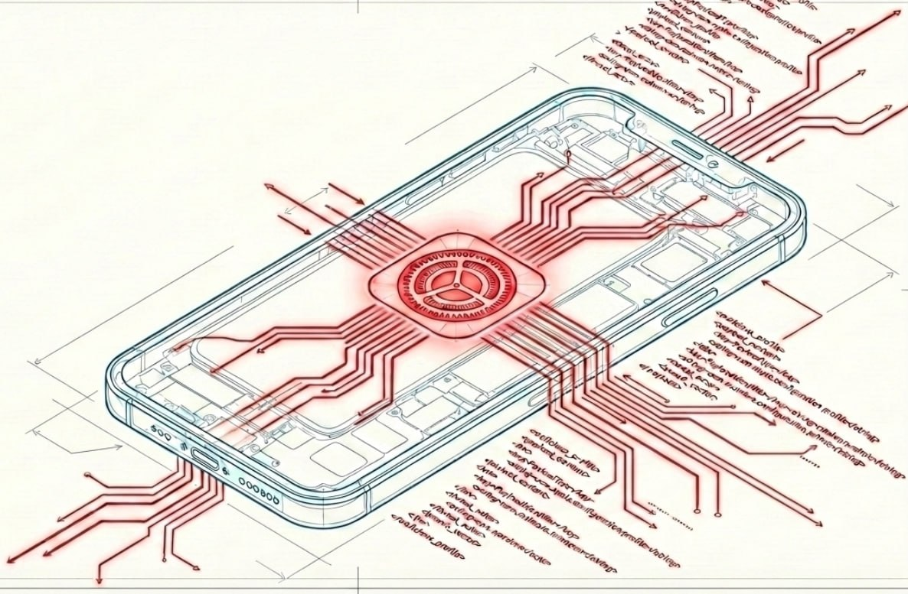

<p align="center">
  
</p>

# ios-profile-builder

A browser-based tool for assembling Apple **`.mobileconfig`** configuration profiles - without hand-writing XML.

Built for offensive security research, MDM lab work, and profile prototyping. Runs fully offline. Zero telemetry, zero outbound connections.

---

## What it does

Apple configuration profiles are XML property lists that push settings, certificates, web clips, and MDM enrollment to iOS / iPadOS / macOS devices. Writing them by hand means wrestling with UUIDs, plist schemas, and CMS signing. This tool replaces all of that with a browser form that emits a correctly structured `.mobileconfig` on the first try.

### Supported payload types

| Payload | Type identifier |
|---|---|
| Web Clip (home-screen shortcut) | `com.apple.webClip.managed` |
| Wi-Fi | `com.apple.wifi.managed` |
| VPN | `com.apple.vpn.managed` |
| Trusted Root CA (PEM or DER) | `com.apple.security.root` |
| MDM Enrollment | `com.apple.mdm` |
| Custom (raw plist fragment) | any |

Up to 10 instances of each type per profile. Empty sections are skipped automatically.

### Additional capabilities

- **Profile metadata** - DisplayName, Identifier, Organization, Description, ConsentText.
- **Auto-generated UUIDs** - every payload and the profile root get fresh UUID4s on each build.
- **Optional CMS signing** - attach a `.p12` / `.pfx` and password; the tool signs with `openssl smime`. Signing status is returned in the `X-Profile-Signing-Status` response header. Works without signing too - unsigned profiles install fine in most lab/research contexts.
- **Payload Reference drawer** - in-UI reference for every common payload type, risks, supervised-only constraints, and attack scenarios.
- **Predefined templates** - Webclip-only, Root CA, Full MDM enrollment.
- **Import & Analyze** - Upload any existing `.mobileconfig` to inspect its contents: profile metadata, per-payload breakdown with risk ratings, and automatic detection of dangerous payload combinations (Full MITM, Device Takeover, Phishing App, etc.).

---

## Requirements

- Python 3.8+
- `pip install -r requirements.txt` (Flask + Werkzeug)
- `openssl` on PATH for signing (optional)

---

## Install & run

### Linux / macOS

```sh
git clone https://github.com/YOUR_USERNAME/ios-profile-builder
cd ios-profile-builder
python3 -m venv venv && source venv/bin/activate
pip install -r requirements.txt
python3 app.py
```

Open **http://127.0.0.1:5000** in a browser.

### Windows

```bat
git clone https://github.com/YOUR_USERNAME/ios-profile-builder
cd ios-profile-builder
python -m venv venv && venv\Scripts\activate
pip install -r requirements.txt
python app.py
```

`openssl` for Windows ships with Git for Windows at `C:\Program Files\Git\usr\bin\openssl.exe`.

---

## CLI flags

```
python3 app.py [--host HOST] [--port PORT] [--debug]
```

| Flag | Default | Description |
|---|---|---|
| `--host` | `127.0.0.1` | Bind address. Keep on loopback for local use. |
| `--port` | `5000` | TCP port. |
| `--debug` | off | Flask debug mode (development only). |

---

## Usage

1. Start the server and open `http://127.0.0.1:5000`.
2. Optionally pick a template from the top bar.
3. Fill in the profile metadata and whichever payload sections you need.
4. Attach a `.p12` + password if you want a CMS-signed output.
5. Click **Build & download** - the browser receives the `.mobileconfig`.
6. Check `X-Profile-Signing-Status` in the browser Network tab to confirm `signed` / `unsigned`.

### Importing & analyzing an existing profile

Click **📂 Import** in the template bar and select any `.mobileconfig` file. A side drawer opens with:

- Profile metadata (DisplayName, Identifier, Organization, Description)
- Per-payload breakdown: risk badge (CRITICAL / HIGH / MEDIUM / INFO), type identifier, and key field values
- **Attack combo detection** - automatically flags dangerous combinations such as Full MITM (Root CA + Wi-Fi + VPN), Device Takeover (MDM + Root CA + VPN), Phishing App (WebClip + Root CA), and others

After closing the drawer, click **📊 Last Import** (appears in the template bar after the first import) to reopen the last analysis without re-uploading.

### Exposing over HTTPS (Cloudflare Quick Tunnel)

iOS requires HTTPS to install profiles served from a remote host. For lab use:

```sh
# Install cloudflared once: https://developers.cloudflare.com/cloudflare-one/connections/connect-apps/install-and-setup/
python3 app.py --host 0.0.0.0 &
cloudflared tunnel --url http://localhost:5000
```

The tunnel prints a temporary HTTPS URL you can share with a test device.

---

## Security design

| Area | Implementation |
|---|---|
| Input handling | All form fields treated as untrusted data. Values flow through `plistlib` only - never executed or interpreted. |
| Custom plist | Parsed and validated before merge; malformed input → 400, not a crash. |
| File upload cap | 8 MB hard limit via Flask `MAX_CONTENT_LENGTH`. |
| Signing errors | `openssl` stderr logged server-side only; the response header returns a generic status string (no path leakage). |
| Temp files | Created in a fresh `tempfile.mkdtemp` dir and removed immediately after response via `shutil.rmtree`. |
| Filename sanitization | Output filename stripped with `os.path.basename` + alphanumeric whitelist before use in `Content-Disposition`. |
| Security headers | Every response carries `X-Content-Type-Options`, `X-Frame-Options: DENY`, `Referrer-Policy`, and `Content-Security-Policy`. |

---

## What this tool does NOT do

- **No persistence on the target device** beyond the profile. It builds a `.mobileconfig`; installing it is the standard Apple user-consent flow.
- **No C2, no callbacks, no beaconing.** The generated profile contains only the payloads you configured.
- **No certificate generation.** It packages a root CA you supply; it does not mint one.
- **No exploitation.** It does not bypass MDM trust prompts, user consent screens, or device security controls.
- **No auth, no multi-user.** Bind to loopback. This is a local builder, not a hardened web service.

---

## Tests

```sh
pip install pytest
pytest -q
```

17 tests, offline, no network access required.

---

## Project layout

```
ios-profile-builder/
├── app.py              # Flask app + payload builders + signing
├── requirements.txt
├── README.md
├── templates/
│   └── index.html      # single-page UI (vanilla JS, no bundler)
├── static/             # logo / branding (not tracked in git)
└── tests/
    └── test_app.py     # pytest suite
```

---

## License

MIT
